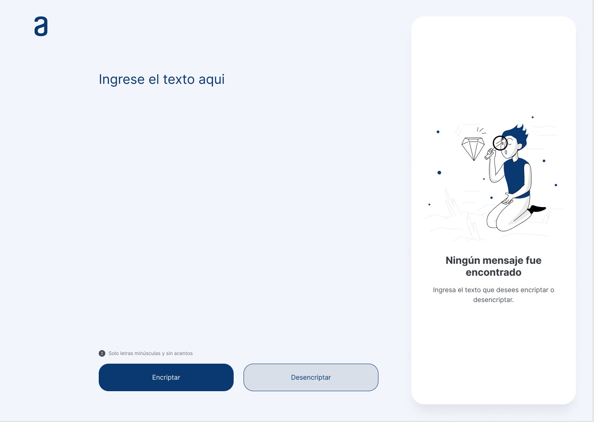

# 🔒 Challenge ONE | Lógica de Programación | Encriptador de texto


## Descripcion del desafio
Este proyecto consiste en encriptar texto y tambien desencriptarlo, funcionando con su respectivos botones.
Los lenguajes que se usaron para este proyecto fueron:

HTML, CSS, JavaScript

## Las "llaves" de encriptación que utilizaremos son las siguientes:

```
La letra "e" es convertida para "enter"
La letra "i" es convertida para "imes"
La letra "a" es convertida para "ai"
La letra "o" es convertida para "ober"
La letra "u" es convertida para "ufat"

```

## Requisitos:
- Debe funcionar solo con letras minúsculas
- No deben ser utilizados letras con acentos ni caracteres especiales
- Debe ser posible convertir una palabra para la versión encriptada también devolver una palabra encriptada para su versión original. 

Por ejemplo:
> "gato" => "gaitober"
> gaitober" => "gato"

- La página debe tener campos para inserción del texto que será encriptado o desencriptado, y el usuario debe poder escoger entre as dos opciones.
- El resultado debe ser mostrado en la pantalla.

## Extras:
- Un botón que copie el texto encriptado/desencriptado para la sección de transferencia, o sea que tenga la misma funcionalidad del "ctrl+C" o de la opción "copiar" del menú de las aplicaciones.
Para la realización de esta parte de nuestro encriptador podemos usar tanto una etiqueta HTML <input> o <textarea>

## Extra! Botón copiar
Estas actividades son referentes al desafío extra, de agregar un botón para copiar texto.